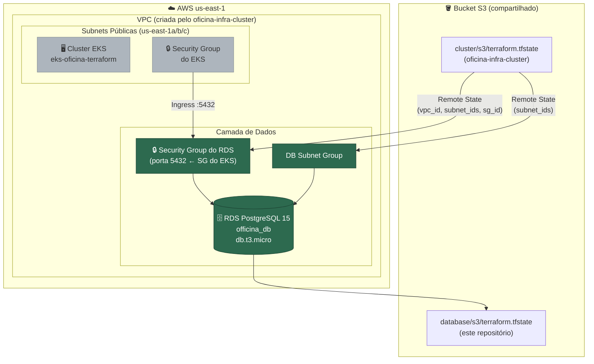

# oficina-infra-database

Repositório responsável por provisionar o banco de dados **PostgreSQL** da Oficina API na AWS,
utilizando o serviço **RDS** dentro da infraestrutura de rede e cluster já criada pelo repositório
[`oficina-infra-cluster`](https://github.com/GrupoPosTech-FIAP/oficina-infra-cluster).

> Este repositório **depende** do `oficina-infra-cluster` estar provisionado primeiro.
> Ele lê os outputs do cluster (VPC, Subnets, Security Group) via Terraform Remote State.

---

## 🗂️ Estrutura do Repositório

```
oficina-infra-database/
├── .github/
│   └── workflows/
│       └── deploy.yml          # Pipeline CI/CD (GitHub Actions)
├── backend.tf                  # State do Terraform salvo no S3
├── data.tf                     # Lê outputs do oficina-infra-cluster via Remote State
├── provider.tf                 # Configuração do provider AWS
├── iam-role.tf                 # Referencia a LabRole do Learner Lab
├── access-entry.tf             # Descobre o account ID da AWS atual
├── security-group.tf           # SG do RDS: libera porta 5432 apenas para o cluster EKS
├── db_subnet_group.tf          # Grupo de subnets para o RDS (reutiliza subnets do cluster)
├── db_instance.tf              # Instância do RDS PostgreSQL
├── variables.tf                # Variáveis de entrada (bucket do state e senha do banco)
├── output.tf                   # Outputs exportados (endpoint, nome e usuário do banco)
├── docker-compose.yaml         # Banco local para desenvolvimento (sem AWS)
└── .env                        # Variáveis para o Docker Compose local
```

---

## 🛠️ Tecnologias Utilizadas

| Tecnologia | Versão | Papel |
|---|---|---|
| **Terraform** | >= 1.2 | Provisionamento de infraestrutura como código (IaC) |
| **AWS RDS** | PostgreSQL 15 | Banco de dados relacional gerenciado |
| **AWS S3** | — | Armazenamento do `terraform.tfstate` |
| **GitHub Actions** | — | Pipeline de CI/CD para provisionamento automático |
| **Docker Compose** | — | Banco PostgreSQL local para desenvolvimento |
| **AWS CLI** | — | Gerenciamento de credenciais e verificação de recursos |

---

## 🏛️ Arquitetura

O diagrama abaixo representa como este repositório se encaixa na infraestrutura completa.
Os recursos em **verde** são provisionados por este repositório; os em cinza já existem e são
apenas referenciados via Remote State.



---

## 🚀 Como Executar

### Pré-requisitos

- [Terraform](https://developer.hashicorp.com/terraform/install) >= 1.2 instalado.
- [AWS CLI](https://aws.amazon.com/cli/) instalado e configurado.
- **`oficina-infra-cluster` já provisionado** — o bucket S3 e o cluster EKS precisam existir.
- Sessão do AWS Academy Learner Lab ativa (ver [Acesso ao Learner Lab](#-acesso-ao-learner-lab)).

---

### Execução Local (Desenvolvimento)

Para rodar o banco na sua máquina sem precisar da AWS, use o Docker Compose:

```bash
# Na raiz do projeto
docker-compose up -d
```

O banco ficará disponível em `localhost:5432` com as credenciais do arquivo `.env`:
- **Usuário:** `postgres`
- **Senha:** `abc123`
- **Database:** `oficina_db`

> ⚠️ O arquivo `.env` está no `.gitignore` — nunca commit credenciais reais nele.

---

### Provisionamento na AWS (Manual via Terminal)

**1. Configure as credenciais do Learner Lab:**

```powershell
# PowerShell
$env:AWS_ACCESS_KEY_ID="<seu_access_key>"
$env:AWS_SECRET_ACCESS_KEY="<seu_secret_key>"
$env:AWS_SESSION_TOKEN="<seu_session_token>"

# Valide:
aws sts get-caller-identity
```

**2. Inicialize o Terraform** (use o mesmo bucket do `oficina-infra-cluster`):

```bash
terraform init -backend-config="bucket=oficina-tfstate-SEU-NOME"
```

**3. Visualize o plano** (sem criar nada ainda):

```bash
terraform plan \
  -var="infra_state_bucket=oficina-tfstate-SEU-NOME" \
  -var="db_password=SuaSenhaAqui123"
```

> Verifique no output que `vpc_id` e `subnet_ids` foram lidos corretamente do remote state.

**4. Aplique** (~10-15 minutos para o RDS ficar disponível):

```bash
terraform apply \
  -var="infra_state_bucket=oficina-tfstate-SEU-NOME" \
  -var="db_password=SuaSenhaAqui123"
```

**5. Anote o endpoint do banco:**

```bash
terraform output -raw DB_Endpoint
```

> Guarde esse valor — ele é necessário como input no deploy da aplicação (`Tech-Challenge-15SOAT`).

---

### Provisionamento na AWS (Via GitHub Actions)

1. Atualize os **3 Secrets de AWS** no repositório (`AWS_ACCESS_KEY_ID`, `AWS_SECRET_ACCESS_KEY`, `AWS_SESSION_TOKEN`) com os valores da sessão atual do Learner Lab.
2. Vá em **Actions → "RDS - CI/CD" → Run workflow**.
3. Preencha os inputs:
   - **`TF_BUCKET_NAME`**: mesmo nome do bucket usado no `oficina-infra-cluster`.
   - **`DB_PASSWORD`**: senha master do banco (anote para uso posterior).
4. Ao final, o log exibirá o `DB_Endpoint` gerado.

---

## ✅ Verificando que Funcionou

```bash
# Via Terraform output
terraform output

# Via AWS CLI — status deve ser "available"
aws rds describe-db-instances \
  --query "DBInstances[*].{Status:DBInstanceStatus,Endpoint:Endpoint.Address,DB:DBName}" \
  --output table \
  --region us-east-1
```

---

## 🔗 Acesso ao Learner Lab

As credenciais do Learner Lab expiram a cada sessão (~4h). Para obtê-las:

1. Acesse [awsacademy.instructure.com](https://awsacademy.instructure.com/) e faça login.
2. Abra **AWS Academy Learner Lab → Modules → Learner Lab**.
3. Clique em **Start Lab** e aguarde a bolinha ficar **verde**.
4. Clique em **AWS Details → AWS CLI** e copie as credenciais.

---

## 🗑️ Destruindo a Infraestrutura

```bash
terraform destroy \
  -var="infra_state_bucket=oficina-tfstate-SEU-NOME" \
  -var="db_password=SuaSenhaAqui123"
```

> Após o destroy, clique em **End Lab** no Learner Lab para evitar consumo de crédito.

---

## 🔗 Repositórios Relacionados

| Repositório | Responsabilidade |
|---|---|
| [`oficina-infra-cluster`](https://github.com/GrupoPosTech-FIAP/oficina-infra-cluster) | VPC, Subnets, EKS, ECR — **deve ser provisionado primeiro** |
| [`oficina-infra-database`](https://github.com/GrupoPosTech-FIAP/oficina-infra-database) | RDS PostgreSQL — este repositório |
| [`Tech-Challenge-15SOAT`](https://github.com/henriquespecian/Tech-Challenge-15SOAT) | Aplicação Spring Boot + deploy no EKS |
